# Azure Hub-and-Spoke Network Architecture with Secure Private Connectivity

## Project Overview

This project demonstrates the design and implementation of an enterprise-style **Azure Hub-and-Spoke network architecture**.

The objective was to build a secure and scalable Azure network environment using core Azure networking services, private Linux virtual machines, secure administration through Azure Bastion, and controlled communication between workloads.

This project demonstrates practical Azure Platform Engineering skills, including:

* Hub-and-Spoke network design
* Virtual Network architecture
* CIDR/IP address planning
* VNet Peering
* VPN Gateway deployment
* Azure Bastion secure access
* Network Security Groups (NSGs)
* Private VM connectivity testing
* Azure networking troubleshooting

---

# Architecture Overview

The environment consists of:

* **Hub VNet** — Central network providing shared services
* **Production Spoke** — Hosts production workloads
* **Development Spoke** — Hosts development workloads
* **Azure Bastion** — Secure browser-based SSH access
* **VPN Gateway** — Secure VPN connectivity capability
* **VNet Peering** — Private communication between networks
* **Network Security Groups** — Traffic filtering and access control

## Network Diagram

```
                         Internet
                            |
                            |
                    VPN Gateway
                            |
                    +---------------+
                    |   Hub VNet    |
                    | 10.0.0.0/16   |
                    |               |
                    | Azure Bastion |
                    +---------------+
                         /       \
                        /         \
                       /           \
              Production          Development
                Spoke                Spoke
             10.1.0.0/16        10.2.0.0/16

                  |                    |
                  |                    |

           Production-VM01      Development-VM01
              10.1.1.5             10.2.1.5
```

---

# Network Design

## Hub Network

| Resource        | Configuration      |
| --------------- | ------------------ |
| Virtual Network | VNhub-vnet         |
| Address Space   | 10.0.0.0/16        |
| VPN Gateway     | VpnGw1AZ           |
| Azure Bastion   | Hub-Bastion        |
| Gateway Subnet  | 10.0.255.0/27      |
| Bastion Subnet  | AzureBastionSubnet |

---

## Production Spoke

| Resource         | Configuration    |
| ---------------- | ---------------- |
| Virtual Network  | Production-Spoke |
| Address Space    | 10.1.0.0/16      |
| Subnet           | ProductionSubnet |
| Virtual Machine  | Production-VM01  |
| Private IP       | 10.1.1.5         |
| Operating System | Ubuntu 24.04     |

---

## Development Spoke

| Resource         | Configuration     |
| ---------------- | ----------------- |
| Virtual Network  | Development-Spoke |
| Address Space    | 10.2.0.0/16       |
| Subnet           | DevelopmentSubnet |
| Virtual Machine  | Development-VM01  |
| Private IP       | 10.2.1.5          |
| Operating System | Ubuntu 24.04      |

---

# Azure Services Used

## Networking

* Azure Virtual Network
* Virtual Network Peering
* VPN Gateway
* Azure Bastion
* Network Security Groups
* Subnets
* Private IP Addressing

## Compute

* Azure Virtual Machines
* Ubuntu Server 24.04 Linux

## Security

* Azure Bastion secure administration
* NSG traffic filtering
* Private VM deployment without public IP exposure

---

# Implementation Process

## 1. Created Hub Virtual Network

The central Hub VNet was created:

```
VNhub-vnet
10.0.0.0/16
```

The Hub network hosts shared services:

* VPN Gateway
* Azure Bastion

---

## 2. Created Spoke Virtual Networks

Two isolated workload networks were created.

### Production Environment

```
Production-Spoke
10.1.0.0/16
```

### Development Environment

```
Development-Spoke
10.2.0.0/16
```

---

## 3. Deployed VPN Gateway

Configured Azure VPN Gateway:

* SKU: VpnGw1AZ
* VPN Type: RouteBased
* Gateway Subnet: 10.0.255.0/27

The gateway provides capability for secure hybrid connectivity.

---

## 4. Deployed Azure Bastion

Azure Bastion was implemented to provide secure VM administration.

Benefits:

* No public IP required on VMs
* Browser-based SSH access
* Reduced exposure to the internet
* Secure management access

---

## 5. Configured VNet Peering

Private connectivity was established between networks.

Configured peerings:

```
Hub VNet ↔ Production-Spoke

Hub VNet ↔ Development-Spoke

Production-Spoke ↔ Development-Spoke
```

This allowed private communication between workloads.

---

# Security Implementation

Network Security Groups were configured to control traffic flow.

Implemented security controls:

* SSH access through Azure Bastion
* Controlled inbound traffic
* Private communication between workloads
* Subnet-level security rules

Example rule:

```
Allow SSH

Source:
Azure Bastion subnet

Destination Port:
22

Protocol:
TCP
```

---

# Connectivity Testing

Connectivity was tested using private IP addresses.

## Production VM → Development VM

Source:

```
Production-VM01
10.1.1.5
```

Destination:

```
Development-VM01
10.2.1.5
```

Result:

```
32 packets transmitted
32 received
0% packet loss
```

---

## Development VM → Production VM

Source:

```
Development-VM01
10.2.1.5
```

Destination:

```
Production-VM01
10.1.1.5
```

Result:

```
32 packets transmitted
32 received
0% packet loss
```

---

# Screenshots

## Azure Bastion

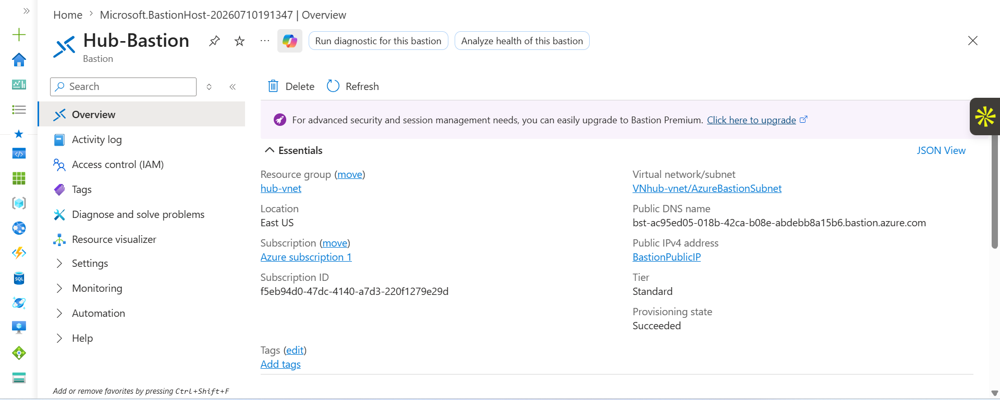

## Hub Virtual Network

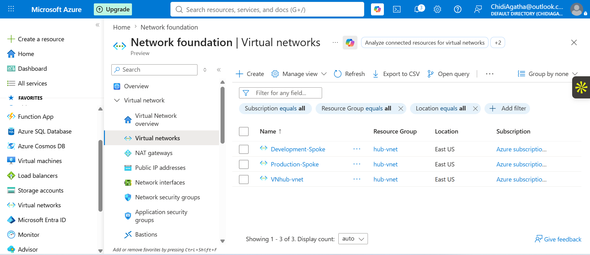

## VPN Gateway

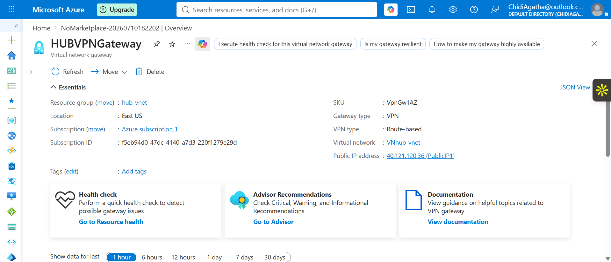

## VNet Peering

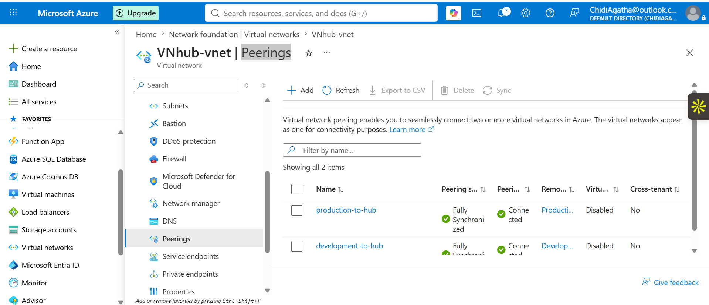

## Production Hub Peering

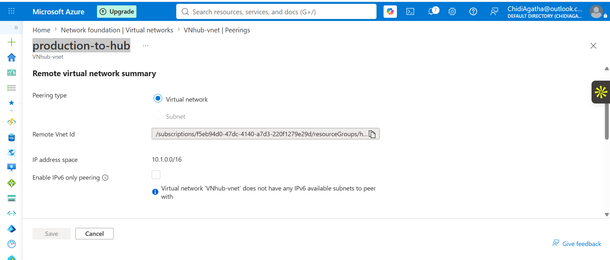

## Resource Group

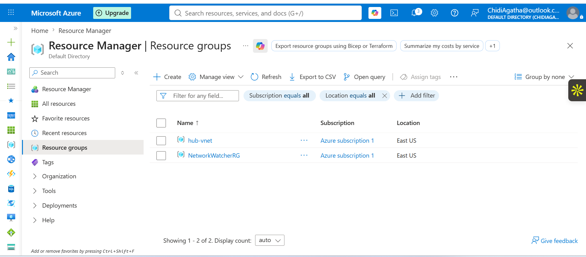

## Production Virtual Machine

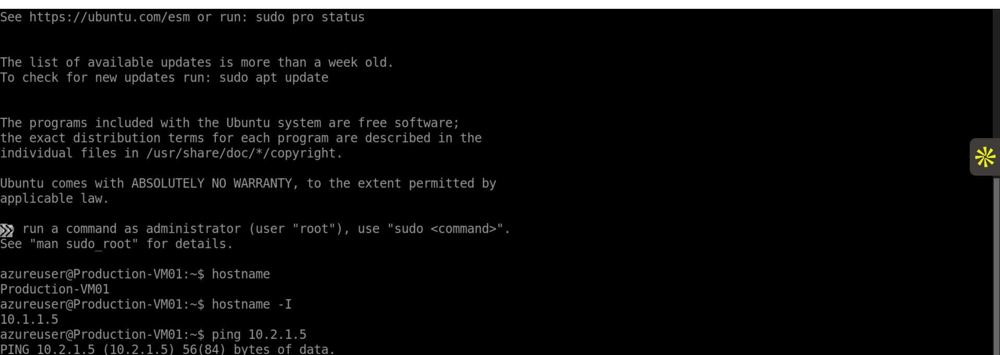

## VM Connections

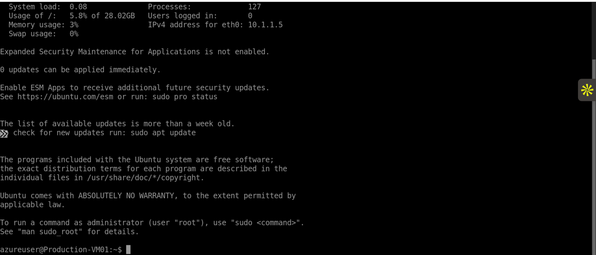

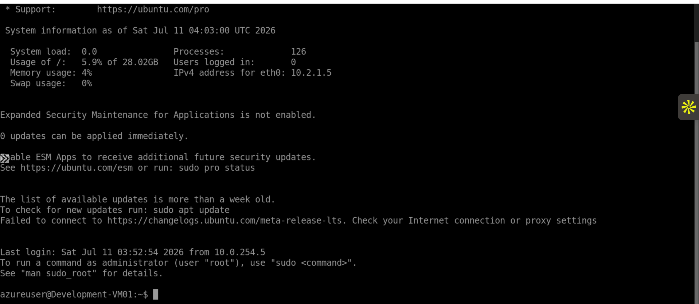

## Connectivity Tests

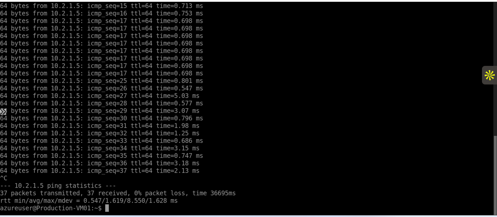

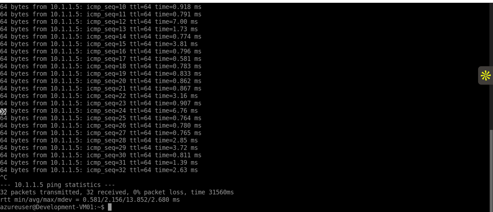

## Network Security Groups

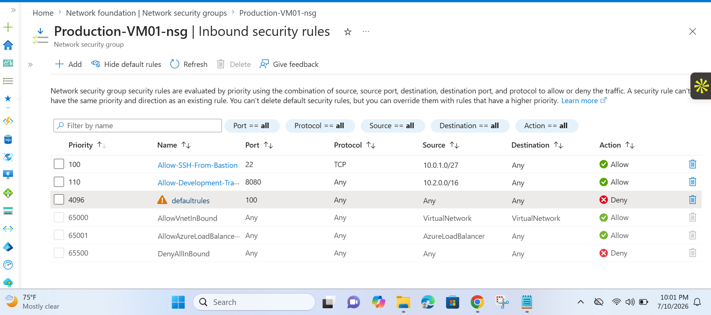

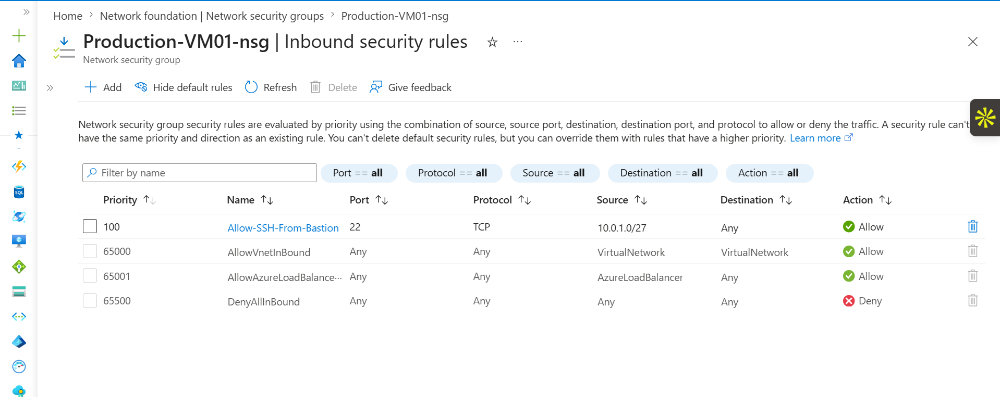

---

# Skills Demonstrated

* Azure Cloud Networking
* Hub-and-Spoke Architecture
* CIDR Planning
* Virtual Network Design
* VNet Peering Configuration
* VPN Gateway Deployment
* Azure Bastion Implementation
* Linux Virtual Machine Administration
* Network Troubleshooting
* NSG Security Controls
* GitHub Documentation

---

# Future Improvements

Potential enhancements:

* Deploy Azure Firewall in the Hub
* Implement User Defined Routes (UDRs)
* Add Azure Monitor and Network Watcher
* Automate deployment using Terraform
* Automate deployment using Bicep
* Simulate hybrid connectivity with on-premises environment

---

# Author

**Agatha Nweze**

Aspiring Azure Platform Engineer

Azure | Linux | Networking | Git & GitHub


